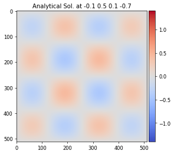
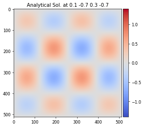
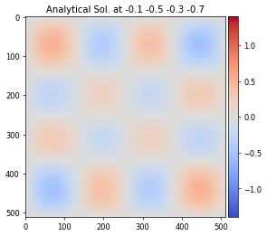
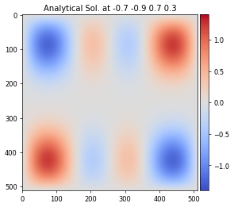

# Analytical expression - Fourier modes as convolution of sine waves.

{width=15%}
{width=15%}
{width=15%}
{width=15%}
{width=15%}
{width=15%}

## Cite This Work

Jekel, C.F., Sterbentz, D.M., Stitt, T.M., Mocz, P., Rieben, R.N., White, D.A. and Belof, J.L., 2024. Machine learning visualization tool for exploring parameterized hydrodynamics. Machine Learning: Science and Technology, 5(4), p.045048. https://iopscience.iop.org/article/10.1088/2632-2153/ad8daa/meta 

```bib
@article{jekel2024machine,
  title={Machine learning visualization tool for exploring parameterized hydrodynamics},
  author={Jekel, CF and Sterbentz, DM and Stitt, TM and Mocz, P and Rieben, RN and White, DA and Belof, JL},
  journal={Machine Learning: Science and Technology},
  volume={5},
  number={4},
  pages={045048},
  year={2024},
  publisher={IOP Publishing}
}
```

## Description

Consider the following equation
$$
  F(x,y,\bm{\beta}) = \big ( \beta_0 \sin(2\pi x) + \beta_1 \sin(4\pi x) \big ) \big( \beta_2 \sin(2\pi y) + \beta_3 \sin(4\pi y)  \big)
$$
where $x$ and $y$ were sampled on a fixed grid of $512 \times 512$ from zero to one. The ML model attempts to learn $F$ as a function of the four $\bm{\beta}$ parameters. This analytical expression is interesting because it is both spatially smooth while exhibiting topology changes with respect to the four $\bm{\beta}$ parameters. The datasets are constructed by taking the cartesian product of some number of samples per dimension. 

There are two scripts to generate the dataset:
- fouriermodes_study.py
- fouriermodes_study_mpi.py

with the mpi version implementing an embarrassingly parallel generation.

```
usage: fouriermodes_study.py [-h] [-nx NX] [-ny NY] [--a_min A_MIN]
    [--a_max A_MAX] [--b_min B_MIN] [--b_max B_MAX] [--c_min C_MIN]
    [--c_max C_MAX] [--d_min D_MIN] [--d_max D_MAX] [-n NSAMP_PER_DIM]

options:
  -h, --help            show this help message and exit
  -nx NX, --nx NX       Spatial Resolution X
  -ny NY, --ny NY       Spatial Resolution Y
  --a_min A_MIN
  --a_max A_MAX
  --b_min B_MIN
  --b_max B_MAX
  --c_min C_MIN
  --c_max C_MAX
  --d_min D_MIN
  --d_max D_MAX
  -n NSAMP_PER_DIM, --nsamp_per_dim NSAMP_PER_DIM
```

Here `a,b,c,d` correspond to $\beta_0, \beta_1, \beta_2, \beta_3$. By default these bounds are [-1, 1]. The default values for `nx` and `ny` where 512, however these values can be changed to other resolutions.

## Scope And Content

WIP.

The dataset generation process generates `imageXXXXXX.h5` and `imageXXXXXX.png` files in the current working directory, where `X`'s denote the sample number.

Generating 11 samples per dimension samples $\bm{\beta}$ at
$$
  \bm{\beta} \in [-1.0, -0.8, -0.6, -0.4, -0.2,  0.0,  0.2,  0.4,  0.6,  0.8,  1.0].
$$
creates 14,641 samples. Togegher the hdf5 files and png files take up approximate 14 GiB on disk.

The shape of the full concatenated dataset is (14641, 1, 512, 512) float32 values for a total of 3.8 billion pixels.

Each h5 file has two keys: `inputs` and `fields`.

The index description of `inputs`:

0. $\beta_0$
1. $\beta_1$
2. $\beta_2$
3. $\beta_3$

Each `field` is the `512 x 512` image array of float32 values. The index description of `fields`: 

0. solution 

H5py can be used to quickly access the data as multidimensional numpy arrays.

```python
import h5py

with h5py.File('image000000.h5','r') as f:
    inputs = f['inputs'][:]
    fields = f['fields'][:]

print(inputs.shape)
print(fields.shape)
```
which should print:
```
(4,)
(1, 512, 512)
```

## Obtain data

This dataset is cheap to generate. The fastest way is to use the mpi sampling to quickly generate samples.
```
mpirun -n 40 python fouriermodes_study_mpi.py -n 11
```

## Author

Charles Jekel

## Funding

This work was supported by the LLNL-LDRD Program under Project No. 21-SI-006.
