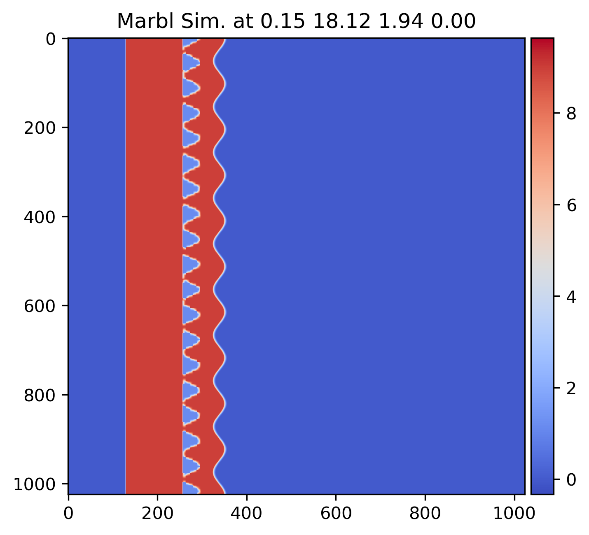
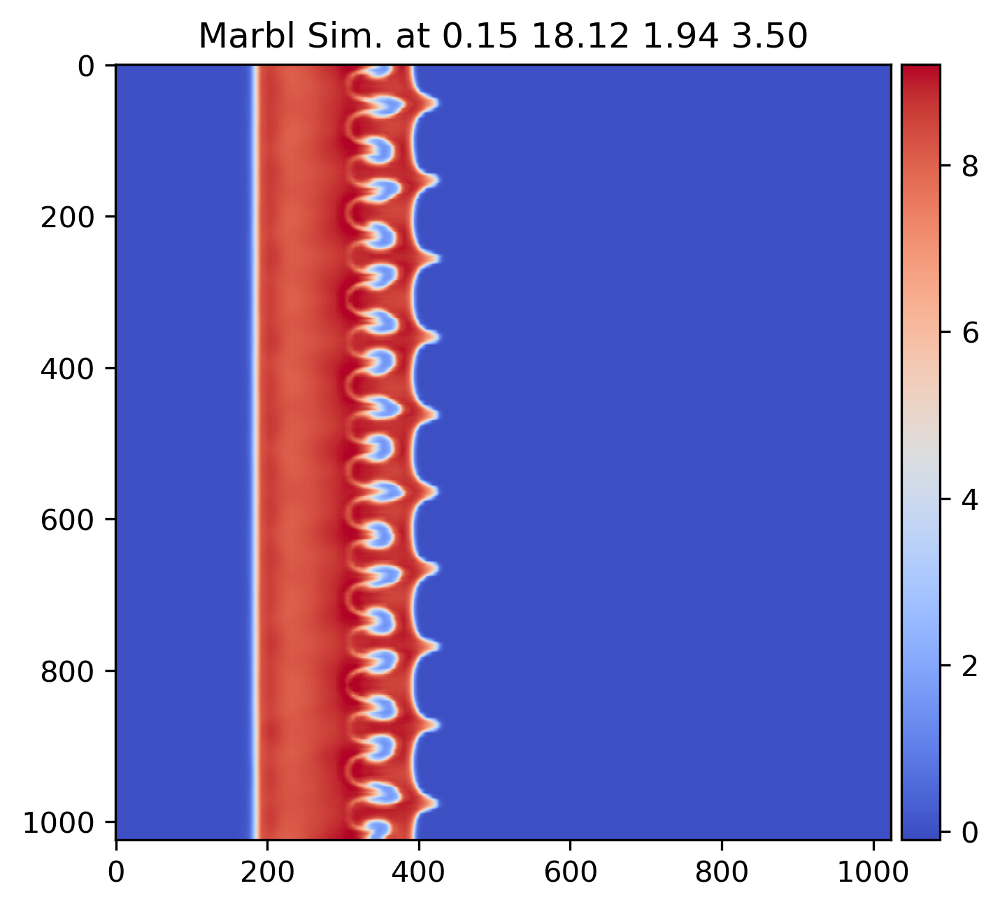
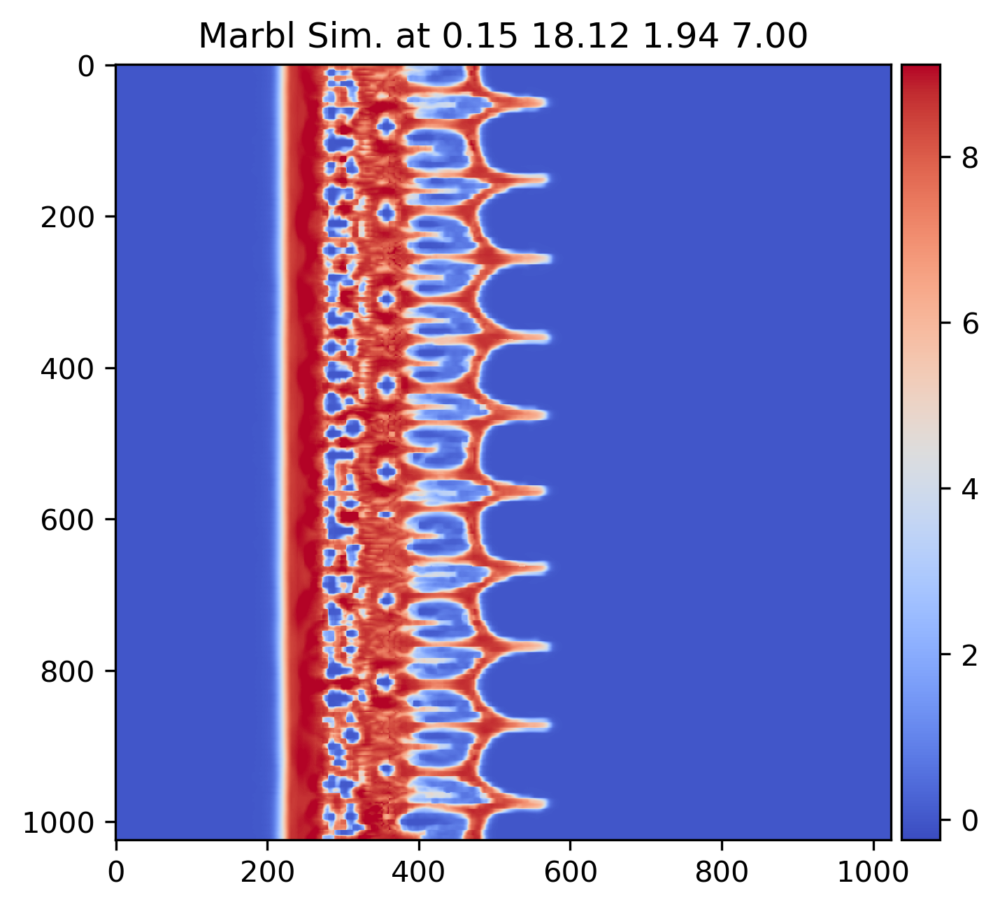
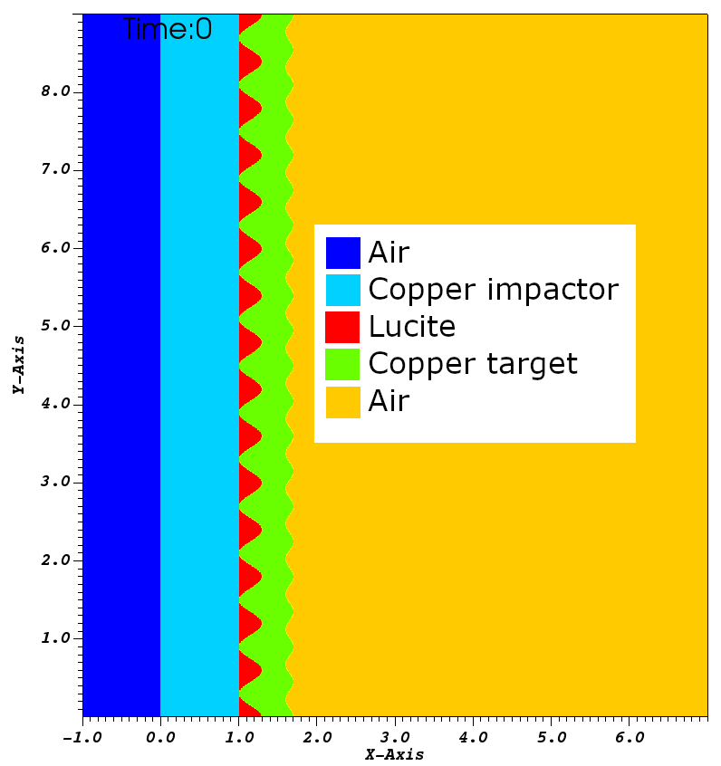

# Ensemble of double sine wave high velocity impact simulations

{width=25%}
{width=25%}
{width=25%}


## Cite This Work

Jekel, C.F., Sterbentz, D.M., Stitt, T.M., Mocz, P., Rieben, R.N., White, D.A. and Belof, J.L., 2024. Machine learning visualization tool for exploring parameterized hydrodynamics. Machine Learning: Science and Technology, 5(4), p.045048. https://iopscience.iop.org/article/10.1088/2632-2153/ad8daa/meta 

```bib
@article{jekel2024machine,
  title={Machine learning visualization tool for exploring parameterized hydrodynamics},
  author={Jekel, CF and Sterbentz, DM and Stitt, TM and Mocz, P and Rieben, RN and White, DA and Belof, JL},
  journal={Machine Learning: Science and Technology},
  volume={5},
  number={4},
  pages={045048},
  year={2024},
  publisher={IOP Publishing}
}
```

## Description

The high velocity impact studies consist of an initially stationary copper target with a perturbation machined into the right-hand side (the copper-air interface), and a copper impactor with velocity of 2 km/s. As the shock wave reaches the interface perturbations, vorticity deposition occurs along the interface due to misalignments between pressure and density gradients at the perturbations. This creates the RMI that generally results in the jetting of the copper target material. The impactor is 1x9 cm and the target is nominally 0.5x9cm. These dimensions and velocities are chosen to be compatible with the two-stage gas gun at LLNL's High Explosive Applications Facility (HEAF)[1,2]. Whereas in actual HEAF experiments the impactor/target are circular with 9cm diameter, the simulations are 2D. The simulations begin at time t=0 with the impactor and target in contact with a discontinuous velocity. 

The impactor side of the target was parameterized with the sinusoidal wave
$$
B \cos \bigg ( \frac{2\pi Q x - s\pi}{9.0} \bigg)
$$
to seed initial RMI growths. The free side of the target (copper-air interface) utilized a fixed wave of
$$
 0.5 + 0.1 \cos \bigg ( \frac{2\pi 10 x}{9.0} \bigg)
$$
which also seed RMI growth. The purpose of this parameterization was to study how parameterized RMI growths interact with a known RMI seed (on the free side), the notion is that an optimized sinusoidal perturbation can initiate vorticity that ‘cancels out’ the primary RMI. The following bounds were placed on the three parameters of the impactor side wave: $B$ from $[0.1, 0.25]$, $Q$ from $[5.0, 25.]$, and $s$ from $[0.0, 3.14]$

An example of the experimental setup of the double sine wave geometry is shown here

{width=40%}


The hydrodynamic solutions were computed using a nominal mesh of 144x144 quadratic (`Q_2 Q_1`) elements. The mesh was morphed to have conformal interfaces. During the simulation the fields density, velocity x, and velocity y are projected onto a 1024x1024 Cartesian image and exported at 51 uniform timesteps from 0 to 7 μs.

[1] Michael Armstrong, Jeffrey Nguyen, Sylvie Aubry, William Schill, Jonathan Belof, and Hector Lorenzana. Use of shock wavefront curvature to modulate rmi jet growth. Bulletin of the American Physical Society, 67, 2022.

[2] Jeffrey Nguyen, Sylvie Aubry, Michael Armstrong, Andrew Hoff, Jonathan Belof, Hector Lorenzana, Matthew Staska, and Brandon LaLone. Modulation of richtmyer-meshkov instability in gas gun experiments. Bulletin of the American Physical Society, 67, 2022.

## Scope And Content

The dataset is stored as 1,626 hdf5 files using gzip compression which takes up 729 GiB on disk. The files are named `simulation_NUMBER.h5`.

The shape of the full concatenated dataset is (1626, 51, 3, 1024, 1024) float32 values.

Each h5 file has two keys: `inputs` and `fields`.

The index description of `inputs`:

0. $B$ amplitude of cosine wave
1. $Q$ frequency multiplier
2. $s$ phase shift factor
3. Time of simulation in μs. 

Each `field` is a `1024 x 1024` image array of float32 values. The index description of `fields`: 

0. density 
1. velocity x 
2. velocity y 

H5py can be used to quickly access the data as multidimensional numpy arrays.

```python
import h5py

with h5py.File('simulation_0000.h5','r') as f:
    inputs = f['inputs'][:]
    fields = f['fields'][:]

print(inputs.shape)
print(fields.shape)
```
which should print:
```
(51, 4)
(51, 3, 1024, 1024)
```

## Obtain data

TODO

```

## Author

C. F. Jekel, D. M. Sterbentz, T. M. Stitt, P. Mocz, R. N. Rieben, D. A. White, and J. L. Belof

## Funding

This work was supported by the LLNL-LDRD Program under Project No. 21-SI-006.
