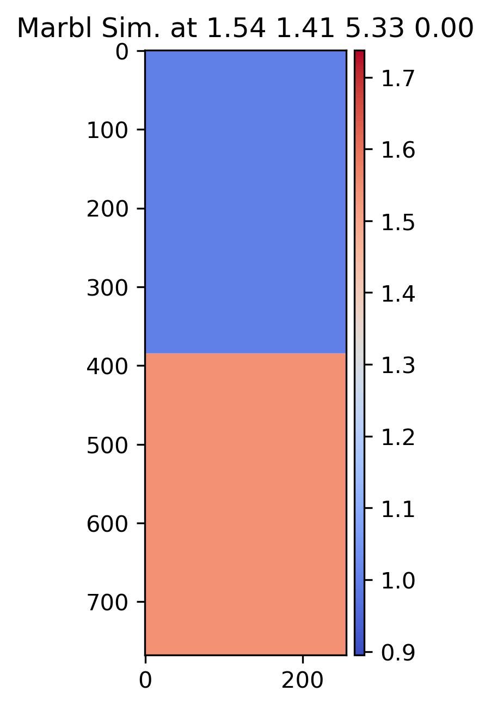
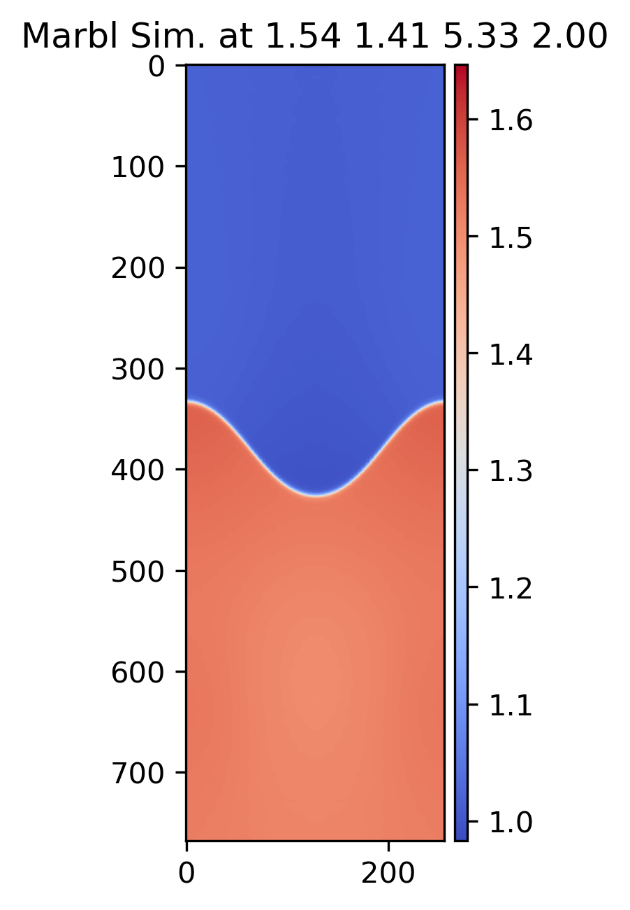
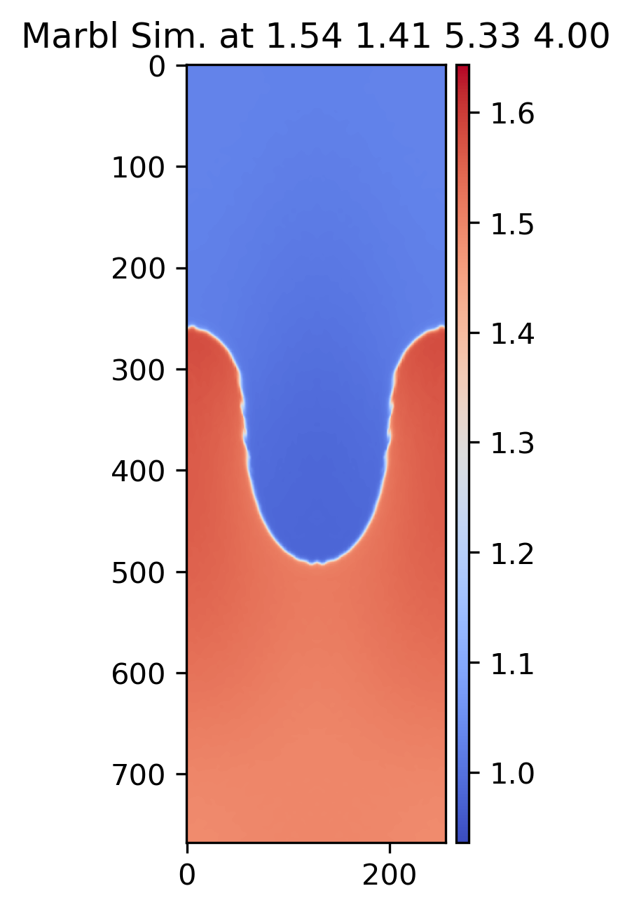
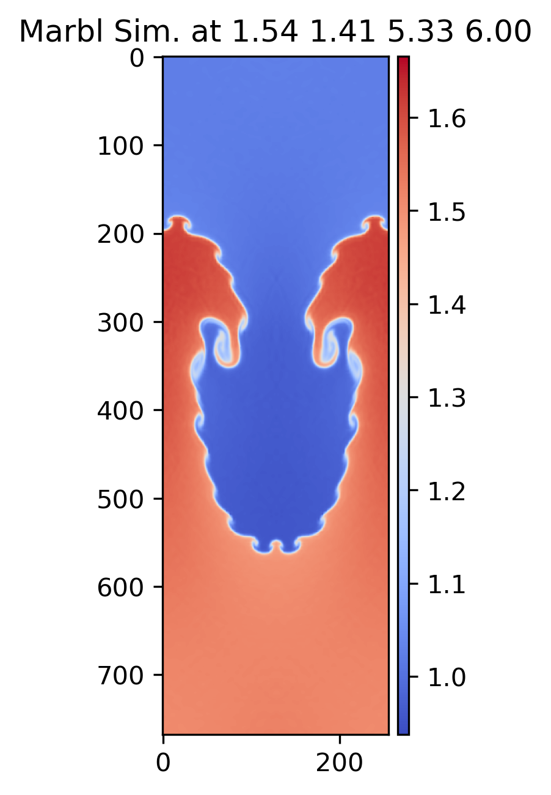
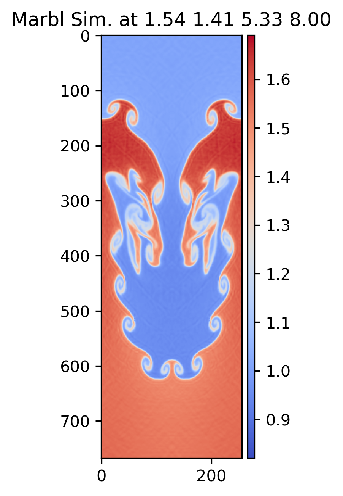
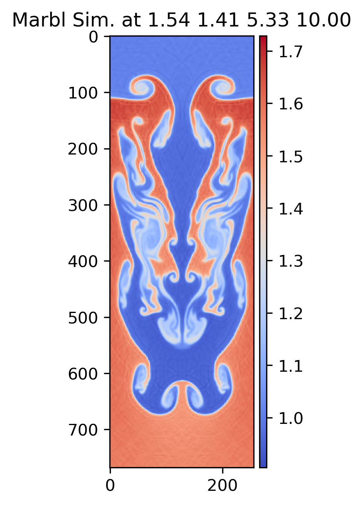

# Ensemble of single-mode Rayleigh-Taylor simulations

{width=15%}
{width=15%}
{width=15%}
{width=15%}
{width=15%}
{width=15%}

## Cite This Work

Jekel, C.F., Sterbentz, D.M., Stitt, T.M., Mocz, P., Rieben, R.N., White, D.A. and Belof, J.L., 2024. Machine learning visualization tool for exploring parameterized hydrodynamics. Machine Learning: Science and Technology, 5(4), p.045048. https://iopscience.iop.org/article/10.1088/2632-2153/ad8daa/meta 

```bib
@article{jekel2024machine,
  title={Machine learning visualization tool for exploring parameterized hydrodynamics},
  author={Jekel, CF and Sterbentz, DM and Stitt, TM and Mocz, P and Rieben, RN and White, DA and Belof, JL},
  journal={Machine Learning: Science and Technology},
  volume={5},
  number={4},
  pages={045048},
  year={2024},
  publisher={IOP Publishing}
}
```

## Description

This dataset is an ensemble of simulations studying the single-mode Rayleigh-Taylor instability (RTI). The setup for the initial RTI was based off of the example in Athena++[1] and the work of [2]. The problem has a `x` domain of `[-1/6, 1/6]` cm and a `y` domain of `[-0.5, 0.5]` cm. A heavier ideal gas is placed on-top of a lighter ideal gas. An initial velocity was applied in `y` direction to seed the instability growth as
$$
  v_y = v_{\text{init}}(u_0*(1+\cos(6\pi x))(1+\cos(2\pi y))/4) 
$$
with `u_0=0.01` cm/s. There is a constant gravitational acceleration of 1.0 cm/s^2.

The simulations were parameterized for three physical parameters: density ratio of the two gases, the heat capacity ratio of γ for both gases, and the initial velocity of
$$
  v_\text{init}.
$$
The parameters were randomly sampled in the following ranges respectively: `[1.1, 6.7], [1.1, 1.6]`, and `[0.6, 10.0]`.

It is well known that this RTI problem becomes turbulent with decreasing feature size as time progresses.
Thus the simulation based on the Euler equations is never fully resolved. Our solutions were computed on a `192 x 64` grid using cubic elements $$Q_3 Q_2.$$

The full field solutions were saved on a `768 x 256` uniform grid. The results contain the following fields: density, velocity `x`, velocity `y`, energy, pressure, and the materials. The simulations were run to 10 s, and results were saved every 0.2 s (with 51 total snapshots per simulation).

[1] Stone, J.M., Tomida, K., White, C.J. and Felker, K.G., 2020. The athena++ adaptive mesh refinement framework: Design and magnetohydrodynamic solvers. The Astrophysical Journal Supplement Series, 249(1), p.4.

[2] Liska, R. and Wendroff, B., 2003. Comparison of several difference schemes on 1D and 2D test problems for the Euler equations. SIAM Journal on Scientific Computing, 25(3), pp.995-1017.


## Scope And Content

The dataset is stored as 102,000 hdf5 files using gzip compression which takes up 328 GiB on disk. The files are named `simulation_NUMBER_TIMESTEP.h5`.

The shape of the full concatenated dataset is (2000, 51, 6, 768, 256) float32 values.

Each h5 file has two keys: `inputs` and `fields`.

The index description of `inputs`:

0. Density ratio of heavier gas over lighter gas. 
1. The heat capacity ratio of γ for both gases. 
2. The initial velocity to seed the instability. 
3. Time of simulation in s. 

Each `field` is a `768 x 256` image array of float32 values. The index description of `fields`: 

0. density 
1. velocity x 
2. velocity y 
3. pressure 
4. energy 
5. materials 

H5py can be used to quickly access the data as multidimensional numpy arrays.

```python
import h5py

with h5py.File('simulation_000000_000.h5','r') as f:
    inputs = f['inputs'][:]
    fields = f['fields'][:]

print(inputs.shape)
print(fields.shape)
```
which should print:
```
(4,)
(6, 768, 256)
```

## Obtain data

The archive `rayleigh-taylor-single.tar.gz` has a sha256sum of TBD. The file will be available online.

## Author

C. F. Jekel, D. M. Sterbentz, T. M. Stitt, P. Mocz, R. N. Rieben, D. A. White, and J. L. Belof

## Funding

This work was supported by the LLNL-LDRD Program under Project No. 21-SI-006.
