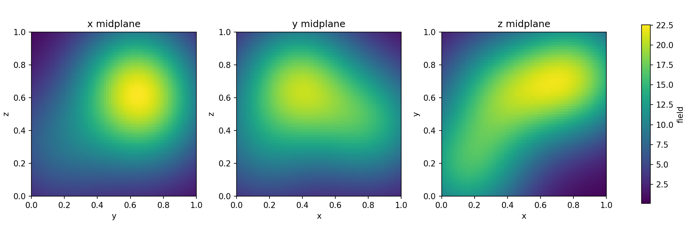
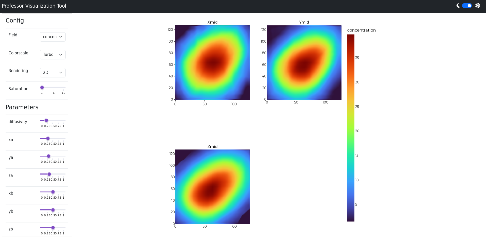

# 3D model tutorial

This tutorial trains Professor to map a small parameter vector to a complete
3D scalar field. It follows the same end-to-end workflow as the introductory
tutorial:

1. generate a synthetic HDF5 dataset;
2. train either the triplane or voxel 3D generator; and
3. inspect the trained model in a browser with `prof-dash-gui`.

The target dataset is produced by
`data/point-source-diffusion-3d/point_source_diffusion.py`. Each realization
adds the analytical diffusion fields from several point sources in a unit
cube. The default three-source dataset has ten inputs: one diffusivity followed
by the x, y, and z coordinates of each source. The target is a single-channel
volume with shape `(1, R, R, R)`.

## Choosing a 3D generator

Professor provides two deployment-ready generators for this workflow:

| Generator | Representation | Practical characteristics |
| --- | --- | --- |
| `3D-triplane` | Builds three learned 2D feature planes, broadcasts them through the volume, and reconstructs the result with 3D convolutions | Usually permits a larger batch because most feature extraction is 2D; the broadcast reconstruction still allocates full 3D feature volumes |
| `3D-voxel` | Builds and upsamples a learned 3D voxel representation using separable 3D convolutions | Operates directly in 3D and generally needs more memory, so the example uses a smaller batch with gradient accumulation |

Both generators accept the same training data and produce an array with the
same channel and spatial dimensions as the target. This makes it straightforward
to train both and compare accuracy, memory use, and throughput on the same
dataset.

The final section uses Professor's Dash-based web GUI to explore orthogonal
slices or a volume rendering while interactively changing the model inputs.

Continue with [data generation](data-generation.md).
