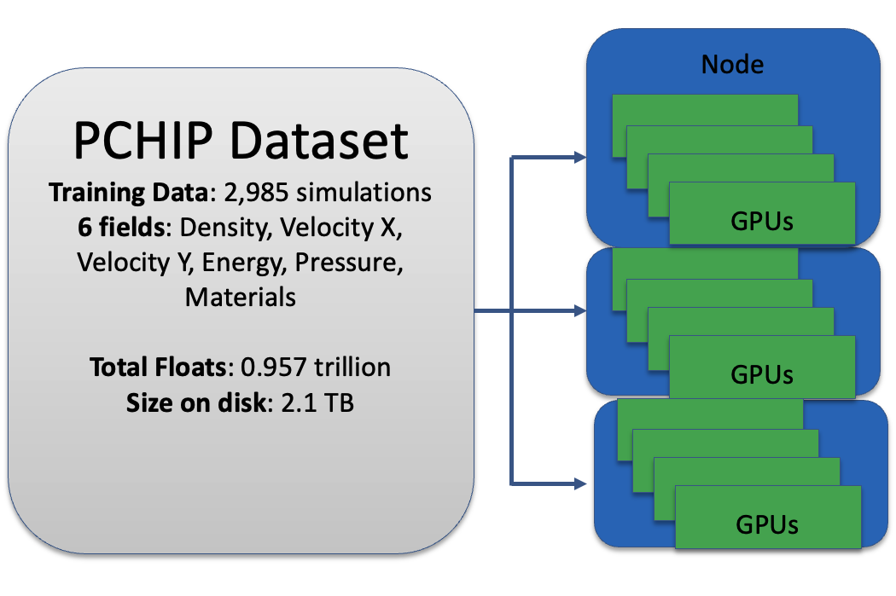

# Basics

There are basically two command line application for using Professor with machine learning (ML) models.

-   `prof-trainer` for training ML models to full-field data 
-   `prof-vis` for visualizing trained ML models in real-time 

For a paper on how this all works in detail, please see [Machine Learning Visualization Tool for Exploring Parameterized Hydrodynamics](https://doi.org/10.1088/2632-2153/ad8daa)

## Full-field data

Dataset inputs must be in [hdf5](https://docs.h5py.org/en/stable/index.html) files. Hdf5 files are great for storing high dimensional arrays, and offer a number of other useful features (e.g. compression, out-of-memory loading).

In addition to the hdf5 data files, we also use a plain text `filelist` to point to the relative path to each **image array** in the `hdf5` files. The plain text file serves as the filepath keys where the hdf5 files contain the values on an unix file system. When used on a parallel file system, this can easily scale to more than 100 TBs of data.

### What is an image array?

Image arrays are essentially mutli-dimensional arrays that contain several fixed-grid images. In pytorch, these image arrays are always `number_of_physical_fields` x `number_of_y_pixels` x `number_of_x_pixels` of float32 values. If you have one physical field (e.g. density), then the image array could have a shape of `1 x 512 x 512` which you can view as an image.

Think of these as scientific images from high fidelity systems (simulation codes, experiments). Typical digital images that your phone takes have `3` fields  of Red, Green, and Blue which is similar to having 3 highly correlated physical fields. It is common to use int8 as the data type to store digital images, while computational codes have access to high precision data. These are just a few differences with our image arrays which have much higher precision at float32, and can have a significant larger number of channels.

### Dataset type 0

This dataset type is essentially one hdf5 file per **image array**. This contains many hdf5 files and a single plain text filelist pointing to the relative paths of those files.

#### Sample hdf5 file

A sample hdf5 file looks like the following when loaded using H5py.

```python
import h5py

with h5py.File('image000000.h5','r') as f:
    inputs = f['inputs'][:]
    fields = f['fields'][:]

print(inputs.shape)
print(fields.shape)
```
which should print:
```
(4,)
(1, 512, 512)
```

There are two keys:

-   'inputs' is the vector of inputs to the ML model (typically the parameters that uniquely define the image conditions)
-   'fields' is the image array

In this case, the inputs are a vector of 4 values, while the image array has 1 physical field, and is the shape of 512x512 pixels.

The hdf5 file must have these exact dimensions! 1 dimension for the inputs, and 3 dimensions for the 'fields'.

#### Sample filelist

The filelist for this dataset type is just a single plain text file pointing to the relative path to each hdf5 file. The following is the head of an example filelist for this dataset type.

```
image000000.h5
image000001.h5
image000002.h5
image000003.h5
image000004.h5
image000005.h5
...
```
where the filelist is located in the same directory as the h5 files.

### Dataset type 1

This dataset type is multiple **image arrays** in each hdf5 file per. As you work with larger and larger datasets, getting close to one million image arrays, it starts to become overly burdensome on the filesystem to put all of these into separate files. Typically we store an entire temporal simulation as a single hdf5 file, but this dataset type will also allow you to put multiple image arrays from several simulations into single files.

#### Sample hdf5 file

A sample hdf5 file looks like the following when loaded using H5py.

```python
import h5py

with h5py.File('simulation_0000.h5','r') as f:
    inputs = f['inputs'][:]
    fields = f['fields'][:]

print(inputs.shape)
print(fields.shape)
```
which should print:
```
(51, 6)
(51, 6, 1024, 1024)
```

Each h5 file has two keys: `inputs` and `fields`. Note that 'inputs' is a two dimensional array, while 'fields' is a four dimensional array. The hdf5 file must have these exact dimensions for this dataset type!

Take note how both arrays start with a shape of `51`. This means there are `51` image arrays in this hdf5 file. Each row in 'inputs' are the values that describe that unique image array. In this case, these are the column descriptions:
0.  First PCHIP parameter in cm.
1.  Second PCHIP parameter in cm.
2.  Third PCHIP parameter in cm.
3.  Fourth PCHIP parameter in cm.
4.  The impact velocity in cm/μs.
5.  Time of simulation in μs. 

There are `51` image arrays, where each has `6` physical fields, and is a `1024 x 1024` matrix of float32 values. The index description of each `fields` happens to be
0.  density 
1.  velocity x 
2.  velocity y 
3.  energy 
4.  pressure
5.  materials 

#### Sample filelist

The filelist for this dataset type is just a single plain text file pointing to the relative path to each hdf5 file **and** the index of each image array (which is separated by a space). Essentially, each frow in the filelist points to a unique image array. If you have 100k image arrays in your dataset, then you'll have 100k rows in your filelist. The following is the head of an example filelist for this dataset type.

```
simulation_0000.h5 0
simulation_0000.h5 1
simulation_0000.h5 2
simulation_0000.h5 3
simulation_0000.h5 4
...
```

where the tail of an example filelist could look like

```
...
simulation_2999.h5 46
simulation_2999.h5 47
simulation_2999.h5 48
simulation_2999.h5 49
simulation_2999.h5 50
```

The filelist is located in the same directory as the h5 files in this example.

Note that `...` is shorthand notation for the pattern continuing. Don't put `...` in your filelist.

## Distributed Data Parallel

These models train using a Distributed Data Parallel (DDP) paradigm. The advantages of this paradigm is it can

1.  take advantage of multiple nodes
2.  uses all GPUs on the node
3.  datasets can be larger than total volatile memory RAM/VRAM 



The simplest model of DDP is that you split your dataset across multiple nodes. Each GPU receives:

-   a copy of the model
-   a copy of the optimizer
-   a unique mini-batch fraction of the data

then on every step, each GPU performs an update on the model using the optimizer as if it was a single gpu job. This is immediately followed by GPU-GPU communication which is used to sync the model and optimizer states across all GPUs! Your dataset primarily lives out-of-memory on the disk, and data is continuously streamed from the disk to memory as needed.

An epoch occurs when the DDP training has stepped over each data point (e.g. **image array**) exactly once. The dataset is then re-shuffled, and different data points will head to different GPUs/nodes in the subsequent epoch. Thus if you have 100 epochs, that means your entire dataset is loaded from disk 100 times! This is very read intensive unlike many other HPC workflows.

This DDP training is a weak scaling process. If you have 10x more data, then you can train the same model in the same time by using 10x more nodes. 

## prof-trainer

`prof-trainer` is the distributed ML training command line executable.

```bash
usage: prof-trainer [-h] [--batch_size BATCH_SIZE] [--lr LR] [--num_epochs NUM_EPOCHS] [--seed SEED] [--n_checkpoint N_CHECKPOINT]
                    [--loss_target LOSS_TARGET] [--max_feature MAX_FEATURE] [--min_feature MIN_FEATURE] [--restart_model RESTART_MODEL] [--keys KEYS]
                    [--dataset_path DATASET_PATH] [--dataset_type DATASET_TYPE] [--dataset_file DATASET_FILE] [--y_kernel Y_KERNEL]
                    [--x_kernel X_KERNEL] [--dataloader_workers DATALOADER_WORKERS] [--hdf5_cache_size HDF5_CACHE_SIZE]
                    [--divide_input_scale DIVIDE_INPUT_SCALE] [--n_sims N_SIMS] [--run_directory RUN_DIRECTORY]
```

Here is a description of each command line argument

-   `batch_size` Mini-batch size controls how many image arrays to be used at a time on each GPU. You generally want the largest value that can fit into memory to optimally load all GPUs on the node. However, as this value gets larger you are likely to see out of memory errors. Normally you can get an idea of an appropriate batch size interactively on a single node.
-   `lr` The learning rate used by the optimizer. This controls how much the optimize moves the model weights at each step. Note that this learning rate is only used on 1 GPU jobs, as an effective learning rate is applied based on the total number of GPUs and batch size to help with scaling training faster in time.
-   `num_epochs` The total number of training epochs. One epoch is one iteration through the entire dataset.
-   `seed` The pseudorandom seed. This does not do much right now as two exact training script will return different ML Models because this does not control the random weight initialization in the ML model.
-   `n_checkpoint` The frequency of epochs to checkpoint the model weights to disk.
-   `loss_target` The objective for the ML training optimizer. Either 'l1' for mean absolute error, or 'l2' for mean squared error are acceptable. Default is 'l1'.
-   `max_feature` The maximum number of channels in the intermediate state of the ML model. If this value is 1024, then you could think of a 1024 colors of a single image. Typically use powers of 2. A larger value means you will have more ML parameters, and have a more complicated intermediate state.
-   `min_feature` The minimum number of channels in the intermediate state of the ML model. Typically use powers of 2. A smaller value means you will have less ML parameters, and a smaller bottleneck in the ML model.
-   `restart_model` (optional) The absolute file path to a previous model checkpoint '.pt' file.
-   `keys` A Comma separated list of fields to fit model to (e.g. 'density,velocity_x,velocity_y'). The number of entries must mach the number of fields in your dataset. The names here are only used to write out tensorboard training logs.
-   `dataset_path` The absolute path to the dataset.
-   `dataset_type` Type 0, 1, or 2 dataset.
-   `dataset_file` The plaintext filelist of all of the hdf5 files. This should be located in the `datset_path`.
-   `y_kernel` The number of y pixels in the first representation of the neural network. This value dictates how many deconvolutional layers are in the neural network, as each subsequent layer doubles the previous layer's number of y pixels. A smaller value typically results in more ML parameters. Usually use values between 2 and 4.
-   `x_kernel` The number of x pixels in the first representation of the neural network. This value dictates how many deconvolutional layers are in the neural network, as each subsequent layer doubles the previous layer's number of x pixels. A smaller value typically results in more ML parameters. Usually use values between 2 and 4.
-   `dataloader_workers` (optional) The number of threads to use on each rank to stream the data from disk to RAM.
-   `hdf5_cache_size` (optional, dataset type 1 only) The number of hdf5 shard files each dataloader worker keeps open in a least recently used cache, instead of reopening the file for every sample. This also keeps the workers alive across epochs so their caches stay warm, and costs about `hdf5_cache_size * dataloader_workers` open files per rank. 0 (the default) reopens the file per sample.
-   `divide_input_scale` (optional) A comma separated list to divide each input by. This is only used for dataset type 2. 
-   `n_sims` The total number of image arrays in your dataset. This is useful for debugging, as you can set this number to be smaller than your dataset to step through smaller epochs quicker. Usually you set this to number to a value much larger number than your dataset
-   `run_directory` (optional) The absolute path to a run directory that will write out model checkpoints and tensorboard results. Use of this folder will trigger a check of existing checkpoints. If checkpoints exist the model will restart from the latest checkpoint.

## prof-vis

`prof-vis` is the interactive ML visualization command line executable.

```bash
usage: prof-vis [-h] [-c CMAP] [-t {light,dark,system}] [-i] [-d] [-v] cfgpath
```
where `cfgpath` is the path to the configuration yaml file that defines the model.

Here is a description of each command line argument

-   `c` initial colormap (any matplotlib colormap) {default: magma}
-   `t` {light,dark,system} specify which theme to use
-   `i` info logging in console (key steps, inference time, fps)
-   `d` debug logging level in console (more verbose than --info)
-   `v` show program's version number and exit
