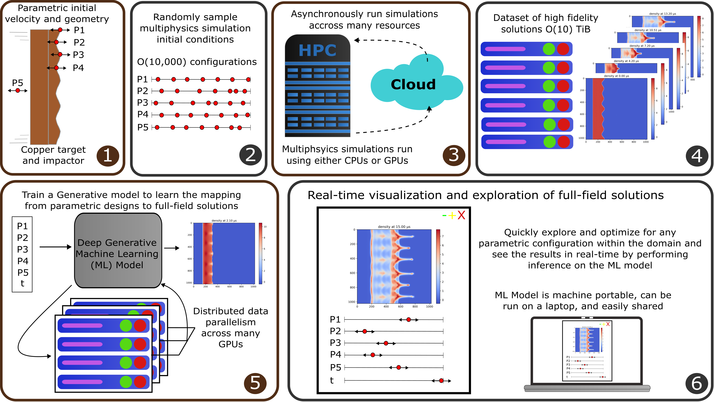

# Professor
```
 ____  ____   ___   _____  ___  _____ _____  ___   ____  
|    \|    \ /   \ |     |/  _]/ ___// ___/ /   \ |    \ 
|  o  )  D  )     ||   __/  [_(   \_(   \_ |     ||  D  )
|   _/|    /|  O  ||  |_|    _]\__  |\__  ||  O  ||    / 
|  |  |    \|     ||   _]   [_ /  \ |/  \ ||     ||    \ 
|  |  |  .  \     ||  | |     |\    |\    ||     ||  .  \
|__|  |__|\_|\___/ |__| |_____| \___| \___| \___/ |__|\_|
                                                         
```
Professor (commonly abbreviated as Prof) is a person who professes to be an expert in some art or science.

Professor is a tool to help you study complicated physical phenomena by providing tools to 1) fit machine learning models to 2D image arrays from simulations and 2) interactively explore these machine learning models in real time. Professor is most useful when studying ensembles of simulations.

A typically workflow would look like:

1.  A user is interested in how parameters A, B, C, & D influence some complicated physics 
2.  User setups up parameterized simulations to study ABCD and the results of these simulations to be image arrays (a 2d matrix of float32 values) 
3.  User runs an ensemble of simulations studying ABCD creating a dataset of image arrays 
4.  User runs `prof-trainer` to fit a machine learning model to learn the mapping from [A,B,C,D] to the image arrays 
5.  User then uses `prov-vis` to interactively explore the machine learning model in real time, gaining their insight into how those parameters influence the physics 
6.  Go profess your idea about ABCD! 


