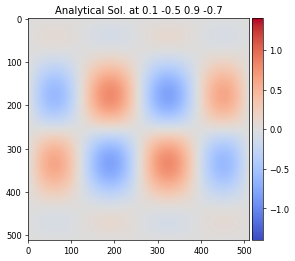
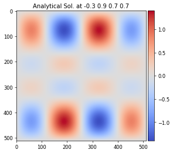

# Tutorial

In this tutorial, users will perform their first end-to-end professor workflow. Users will

1.  Generate an image array dataset on an analytical function
2.  Train a ML model using distributed training
3.  Visualize the resulting ML model

## Analytical expression - Fourier modes as convolution of sine waves

Consider the following equation
$$
F(x,y,\boldsymbol{\beta}) = \big ( \beta_0 \sin(2\pi x) + \beta_1 \sin(4\pi x) \big ) \big( \beta_2 \sin(2\pi y) + \beta_3 \sin(4\pi y)  \big)
$$
where $x$ and $y$ were sampled on a fixed grid of $512 \times 512$ from zero to one. The ML model attempts to learn $F$ as a function of the four $\boldsymbol{\beta}$ parameters. This analytical expression is interesting because it is both spatially smooth while exhibiting topology changes with respect to the four $\boldsymbol{\beta}$ parameters. The datasets are constructed by taking the cartesian product of some number of samples per dimension. 