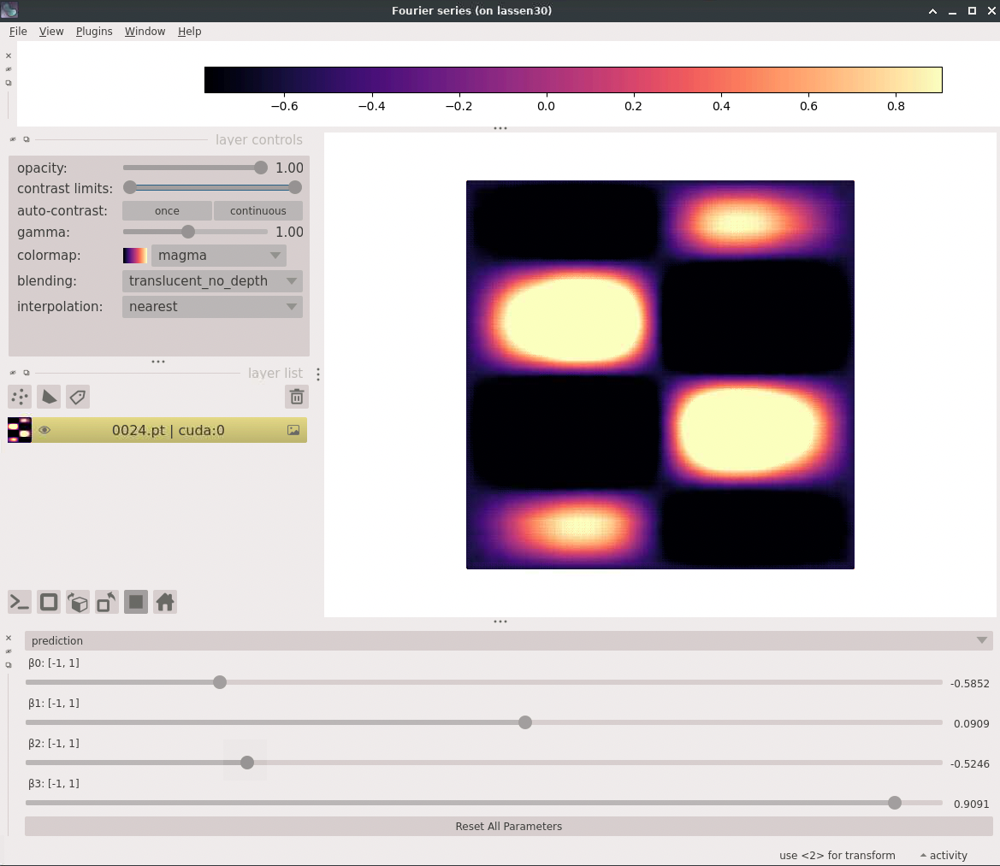

# ML visualization

Here is an example `prof-vis` config file for the analytical ML model you just trained.

```yaml title="analytical.yaml"
--8<-- "configs/analytical.yaml"
```

!!! note

    You will need to replace the `/path/to/checkpoint/0024.pt` under the `model > pytorch > checkpoints`
    section to reflect the absolute path of your target checkpoint file!
    If you are still training, you can also grab an earlier checkpoint file.


Under `model > pytorch > invocation` you should see many of the same command line arguments that went into `prof-trainer`.

Under `model > pytorch > execution` are two settings related to the inference performance of the model.

-   `half_precision` which is wether to use half precision (float16) rather than the models default float32. Using Half precision makes the model faster for visualization. If you are running something like an optimization on the model, you will want to set this to false.
-   `jit` is for just-in-time compilation. Setting this to true should give you faster visualization performance.


=== "tuolumne.llnl.gov"

    Make sure you changed the `model > pytorch > checkpoints` setting to point to your latest checkpoint.

    Do the following:

    1.  Open a czvnc session
    2.  In a terminal ssh to tuolumne
    
    To request an allocation, then run prof-vis on your analytical model, do the following:
    
    ```bash
    flux alloc -N 1 -q pdebug
    /usr/workspace/prof/bin/prof-vis analytical.yaml
    ```


=== "generic"

    Make sure you changed the `model > pytorch > checkpoints` setting to point to your latest checkpoint.

    Simply run prof-vis on the .yaml file    
    ```bash
    prof-vis analytical.yaml
    ```

This should pop up a napari GUI window. Feel free to slide the sliders and explore this function!



Congrats! You are now a `prof-expert`!
